# 🏢 Active Directory Home Lab Project

## 📌 Overview
This project demonstrates the implementation of a **Windows Active Directory environment** using virtual machines. The lab simulates a real-world enterprise setup where a domain controller manages users, groups, policies, and network resources.

This project covers:
- Active Directory Domain Services (AD DS)
- Bulk user creation using PowerShell
- Organizational Units (OUs) and Security Groups
- Group Policy Objects (GPOs)
- Static IP and DNS configuration
- Domain joining (client to server)
- Network drive mapping and file permissions

---

## 🛠️ Technologies Used
- VMware Workstation Pro  
- Windows Server 2022 (Domain Controller)  
- Windows 11 Enterprise (Client Machine)  
- PowerShell  
- Active Directory Users and Computers (ADUC)  

---

# ⚙️ 1. Active Directory Domain Setup

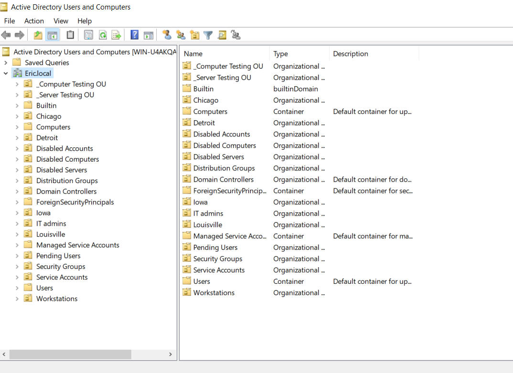

This screenshot shows the initial Active Directory structure after configuring the domain **Eric.local**.  
I organized the environment using Organizational Units (OUs) to represent different locations such as Louisville, Detroit, Chicago, and Iowa.

This structure is important because:
- It allows scalable user and computer management  
- Policies can be applied at different levels (OU-based targeting)  
- It reflects how enterprise environments logically separate resources  

---

# 👥 2. Bulk User Creation (PowerShell)

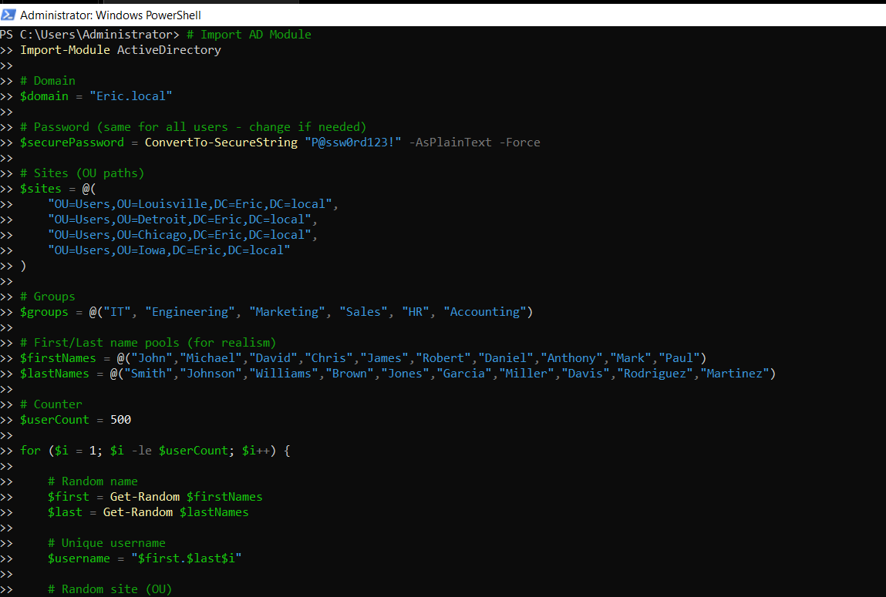

To simulate a real enterprise onboarding process, I created a PowerShell script that automatically generates **500 users**.

The script performs the following:
- Assigns each user a unique username  
- Places users into specific OUs based on location  
- Adds users to department-based security groups (IT, HR, Sales, Engineering, Marketing, Accounting)  

This demonstrates automation skills and reduces the need for manual account creation in large environments.

---

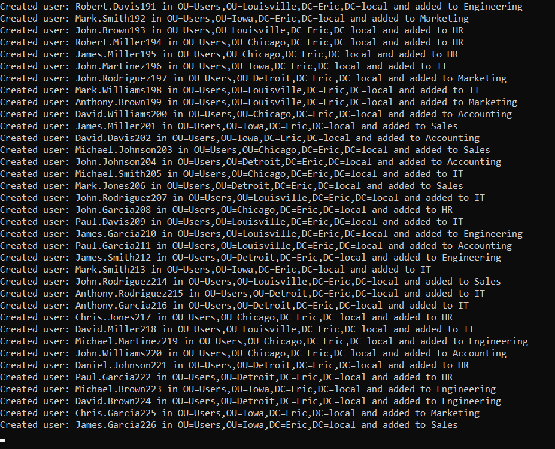

This output confirms that all users were successfully created and distributed across multiple OUs and groups.

This validates:
- Script execution success  
- Proper OU targeting  
- Group membership assignment  

---

# 🔐 3. Group Policy Configuration

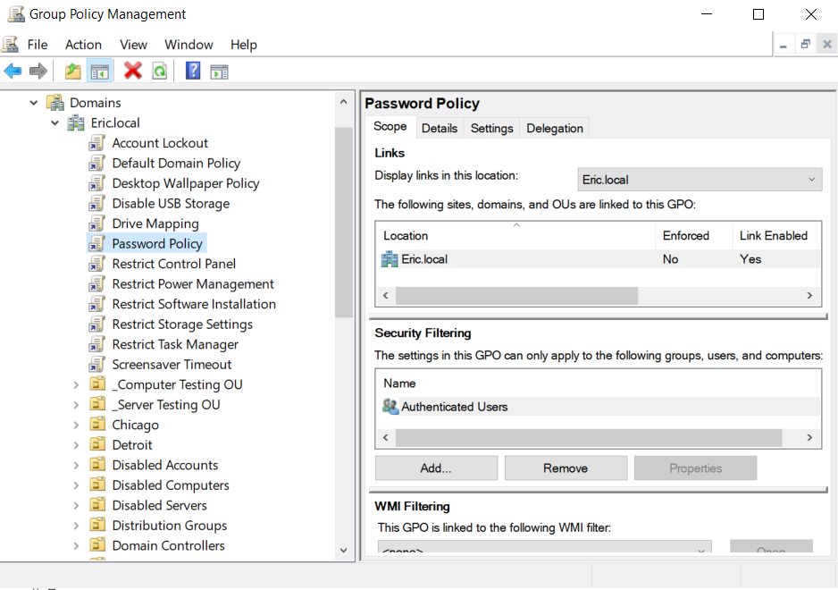

Group Policy Objects (GPOs) were created to centrally manage user and system configurations across the domain.

Through Group Policy, I was able to:
- Enforce security policies  
- Control system behavior  
- Apply configurations to specific users and groups  

This is a critical enterprise tool used for managing large environments efficiently.

---

# 🌐 4. Static IP Configuration (Domain Controller)

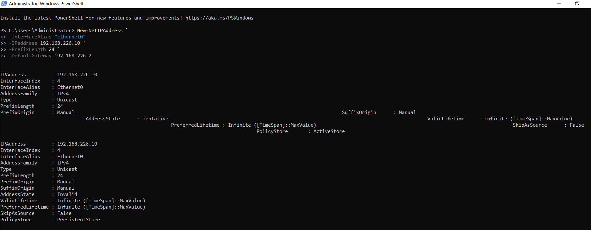

A static IP address was configured on the domain controller to ensure consistent communication within the network.

This is critical because:
- Domain Controllers should not rely on DHCP  
- Services like DNS require a stable IP address  
- Other machines depend on this IP to locate domain services  

---

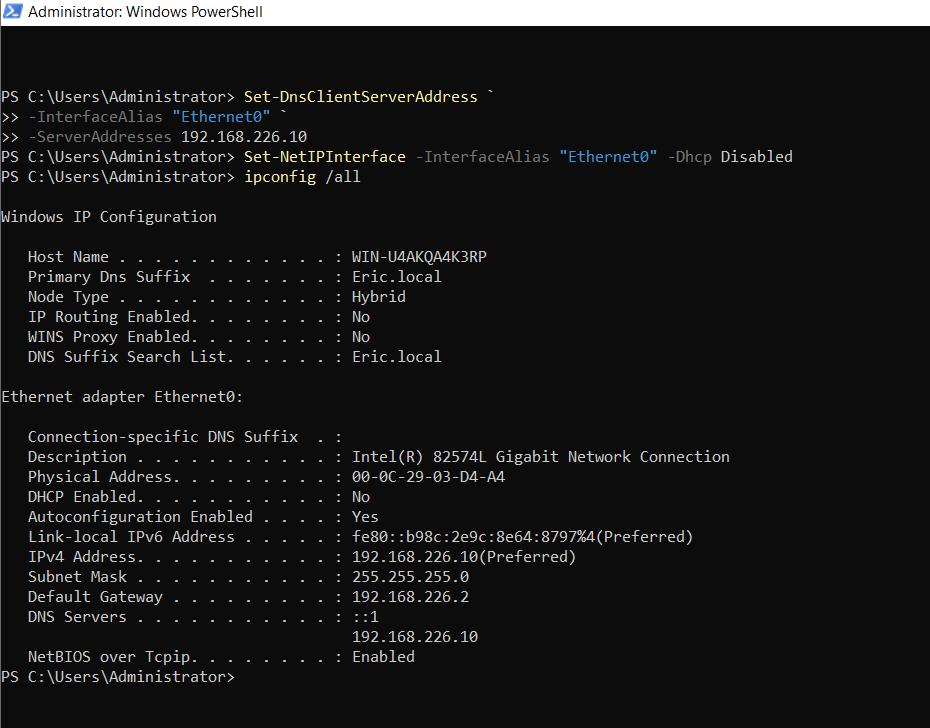

This confirms that the static IP configuration was successfully applied and DHCP was disabled.

This ensures:
- Stability in network communication  
- Reliable domain and DNS functionality  

---

# 🔍 5. Network Connectivity Test

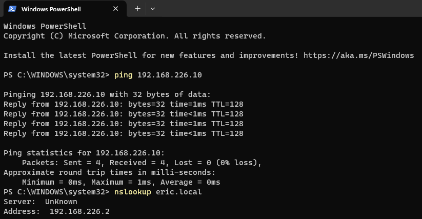

After configuring networking, I tested connectivity by pinging the domain controller from the client machine.

This step verifies:
- Network communication between systems  
- Proper IP configuration  
- That both machines are on the same virtual network  

---

# 🖥️ 6. Domain Join (Client Machine)

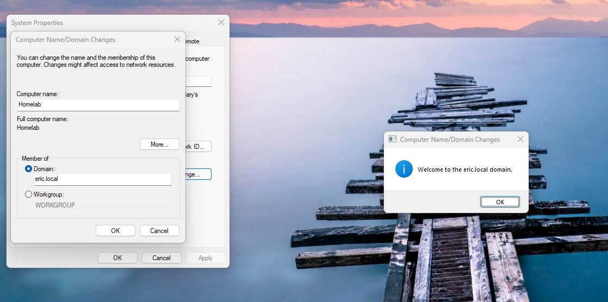

After configuring DNS correctly (pointing to the domain controller), the Windows 11 client machine was successfully joined to the **Eric.local domain**.

This demonstrates:
- Proper DNS dependency for Active Directory  
- Successful authentication with the domain controller  
- Integration of a client machine into a centralized domain environment  

---

# 🔑 7. Password Policy Enforcement

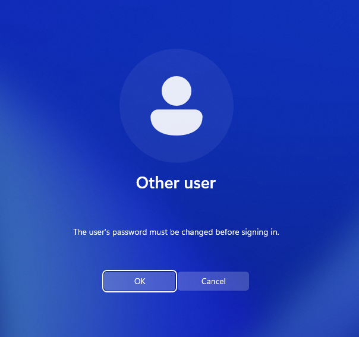

A Group Policy was created to enforce password requirements across the domain.

This policy ensures:
- Users must follow security standards  
- Password changes are enforced  
- Accounts remain secure  

---

# 📂 8. File Permissions Configuration

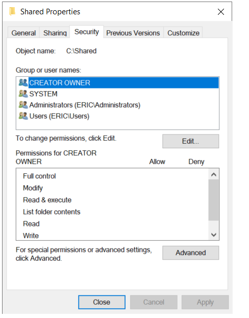

A shared folder was created on the server and configured using NTFS permissions based on security groups.

This demonstrates:
- Role-Based Access Control (RBAC)  
- Secure file access based on group membership  
- Separation of access between departments  

---

# 🔗 9. Network Drive Mapping

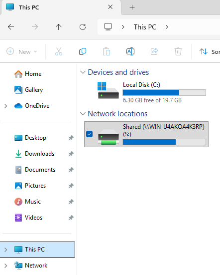

The shared folder was mapped as a network drive on the client machine.

This allows:
- Easy access to shared resources  
- Centralized storage for users  
- Real-world enterprise file server functionality  

---

# 🧠 Challenges & Troubleshooting

During this project, I encountered an issue where the Windows Settings application inside the virtual machine would not open properly, preventing me from configuring a static IP address through the GUI.

To resolve this:
- I switched to using PowerShell instead of the graphical interface  
- Used networking commands to manually assign a static IP and DNS settings  

This approach not only resolved the issue but also reinforced the importance of:
- Command-line troubleshooting  
- Understanding underlying system configurations  
- Being able to work without relying on GUI tools  

---

# 🧠 Key Skills Demonstrated

- Active Directory administration  
- PowerShell automation  
- Network configuration (IP & DNS)  
- Domain environment setup  
- Group Policy management  
- Access control and file permissions  
- Troubleshooting system and network issues  

---

# 🚀 Summary

This project simulates a real-world enterprise IT environment by combining networking, system administration, and security concepts.

Through this lab, I gained hands-on experience in:
- Managing domain infrastructure  
- Automating administrative tasks  
- Enforcing security policies  
- Configuring enterprise network services  
